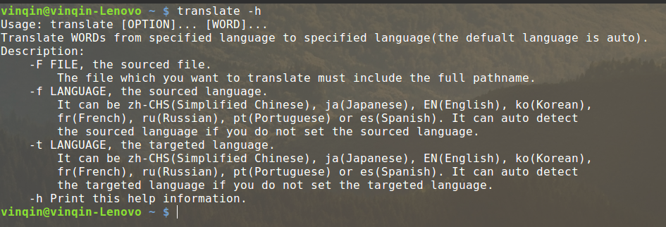
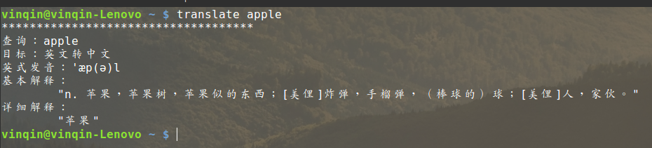
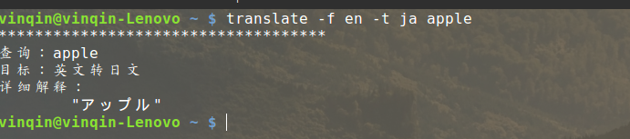

# youdao

### 简介

这是一款利用有道智云API，用Java和shell script实现的Linux终端翻译小工具。

支持简体中文，英文，日文，韩文，法文，俄文，葡萄牙文和西班牙文共八种语言之间两两互相翻译。

### 安装

1. 下载`youdao_v2.tgz`和`setup.sh`于同一目录中
2. 终端执行`bash setup.sh`

### 使用帮助

```bash
translate [-F file] [-f from] [-t to] [-h] word...
[-F file] 指定需要翻译的内容所在的纯文本文件，或者不指定此选项，需要翻译的内容直接来自于参数word
[-f from] 指定需要翻译的内容的语言类型，from可以是zh-CHS，EN，ja，ko，fr，ru，pt，es。
		  不区分大小写。分别代表简体中文，英文，日文，韩文，法文，俄文，葡萄牙文和西班牙。
		  也可以不指定此选项，让程序自动识别需要翻译的内容的语言类型。
[-t to] 指定翻译后的目标语言的类型，同上[-f from]
[-h] 显示此工具的帮助信息。
```

### 示例








